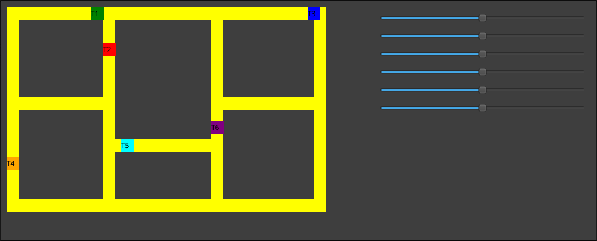

# Projeto Trem

Este é um projeto de simulação de trens desenvolvido em C++ utilizando a biblioteca Qt para a interface gráfica e conceitos de sistemas operacionais, como threads, mutexes e semáforos para controle de concorrência.

## Descrição

O projeto simula o movimento de 6 trens em uma malha ferroviária compartilhada, conforme especificado no documento "Projeto_dos_Trens.pdf". Os trens, representados por pequenos quadrados coloridos (verde, vermelho, azul, laranja, ciano e roxo), circulam em suas malhas internas no sentido horário. Cada trem é executado em uma thread independente, permitindo movimento assíncrono.

O objetivo principal é evitar colisões e deadlocks entre os trens. Para isso, são definidas pelo menos 9 regiões críticas na malha, onde os trens podem entrar em conflito. A sincronização é realizada exclusivamente através de mutexes e semáforos.

A velocidade de cada trem é controlada por sliders na interface gráfica, variando de 0 (parado) a 200 (velocidade máxima, quase invisível ao olho humano).

Este projeto foi desenvolvido como parte da disciplina de Sistemas Operacionais (IMD0036) da UFRN, Unidade 2, focando em programação concorrente.

Para mais detalhes sobre as especificações e requisitos, consulte o arquivo `Projeto_dos_Trens.pdf` incluído no repositório.



## Requisitos da Solução

De acordo com as especificações do projeto:

1. Cada trem deve executar em uma thread independente.
2. Os trens devem se mover sempre que possível, sem causar colisões ou deadlocks.
3. Utilizar pelo menos 9 mutexes ou semáforos para as regiões críticas.
4. A sincronização deve ser baseada exclusivamente em mutexes e semáforos.
5. A interface deve incluir sliders para controle de velocidade (0-200).
6. Os trens iniciam o movimento automaticamente ao abrir o aplicativo.

## Pré-requisitos

- Qt5
- CMake
- Compilador C++

## Como Construir

1. Clone ou baixe o repositório para o seu diretório local.

2. Navegue até o diretório do projeto:
   ```
   cd /caminho/para/projeto_trem
   ```

3. Crie um diretório de build:
   ```
   mkdir build
   cd build
   ```

4. Execute o CMake para gerar os arquivos de build:
   ```
   cmake ..
   ```

5. Compile o projeto:
   ```
   make
   ```

## Como Executar

Após a compilação, execute o programa:
```
./projeto_trem
```

A interface gráfica será aberta, mostrando a pista e os controles para ajustar a velocidade dos trens.

## Funcionamento

- **Malha Ferroviária**: Os trens circulam em loops retangulares compartilhados, com regiões críticas onde podem ocorrer colisões.
- **Sincronização**: Utiliza mutexes para regiões exclusivas e semáforos para controlar o número de trens em áreas compartilhadas (ex.: semáforos com capacidade 2).
- **Controle de Velocidade**: Sliders ajustam a velocidade de cada trem individualmente, permitindo demonstrações de diferentes cenários de concorrência.

## Conceitos Utilizados

- **Threads**: Cada um dos 6 trens roda em sua própria thread para simular movimento simultâneo e assíncrono.
- **Mutexes**: 9 mutexes utilizados para proteger regiões críticas exclusivas, evitando condições de corrida.
- **Semáforos**: 2 semáforos com capacidade 2, controlando o acesso a seções da pista onde até 2 trens podem passar simultaneamente.

## Autor

Desenvolvido por Alison Andrade como projeto acadêmico para a disciplina de Sistemas Operacionais - UFRN.

## Licença

Este projeto é para fins educacionais e não possui licença específica.